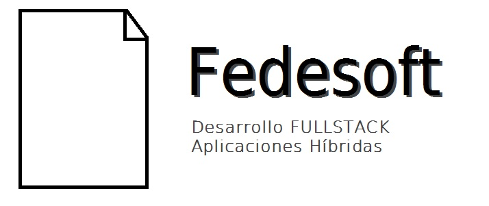

Actividades realizadas en Desarrollo FULL STACK y Aplicaciones Híbridas de Fedesoft.

## Prototipado

En Prototipado se encuentran los documentos en los cuales se basó la diagramación del prototipo.

* Sketch dibujado en papel
* Primera pantalla de menú principal
* Pantalla de inicio de sesión

## Perfil Hoja de Vida

En Perfil Hoja de Vida se encuentra todo el conjunto de archivos realizados para mostrar un Curriculum Vitae
basado en HTML5 y CSS. 

## Diseño ModulosDesk

En Diseño ModulosDesk se encuentra la réplica del diseño FrontEnd de la página Web asignada en la tarea de
la segunda semana. Incluye imágenes, SCSS, y HTML5. 

## Actividad del Gol

En Actividad del Gol se encuentra el desarrollo dado a un reto de animación utilizando CSS y HTML5, de hacer
una anotación en una cancha utilizando estados y keyframes de CSS. 

## Mostrar Partidos 

En Mostrar Partidos se encuentra el desarrollo a la actividad de mostrar los partidos del mundial disponiendo  
de un JSON con toda la información de los equipos y un API ([Country Flags API](http://countryflags.io/)), utilizando AngularJS y ECMAScript.

___

Y otras actividades a futuro. 
